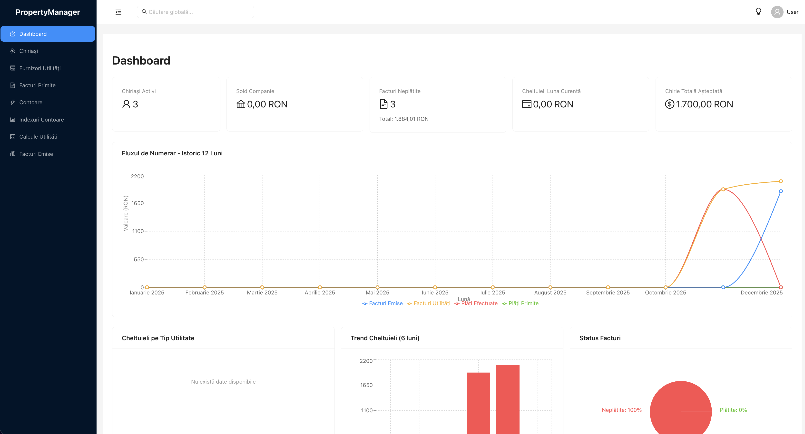
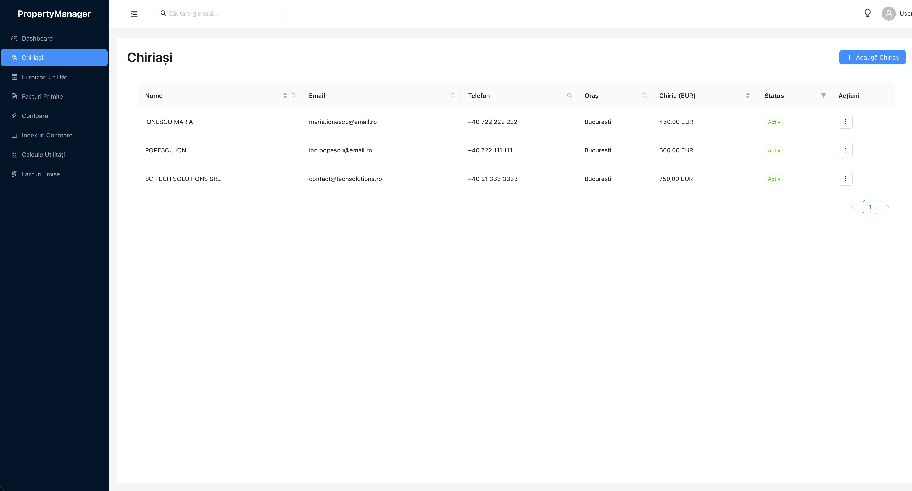
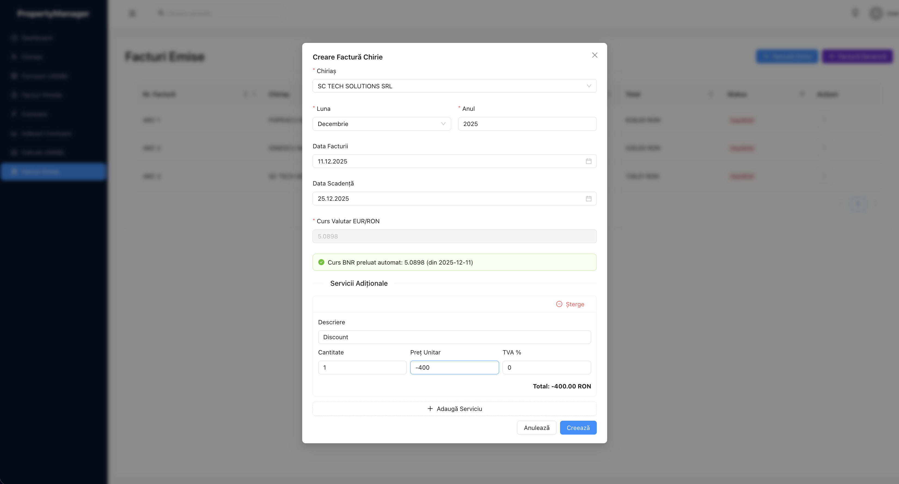
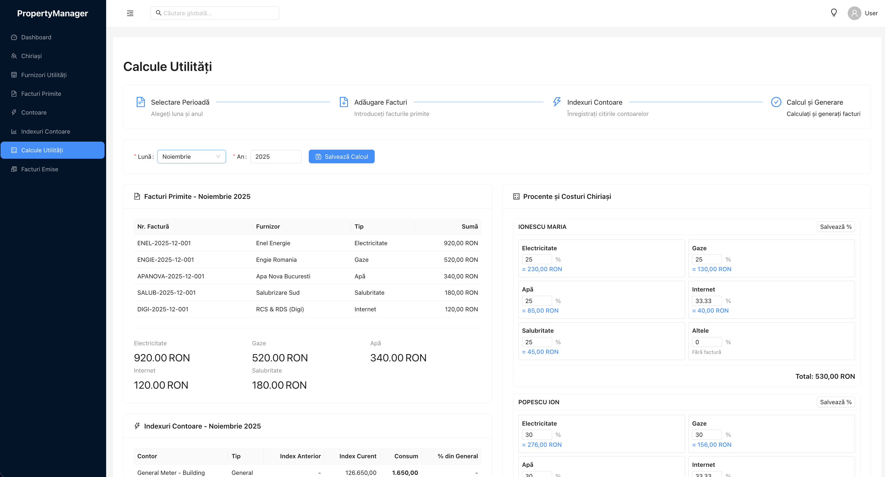
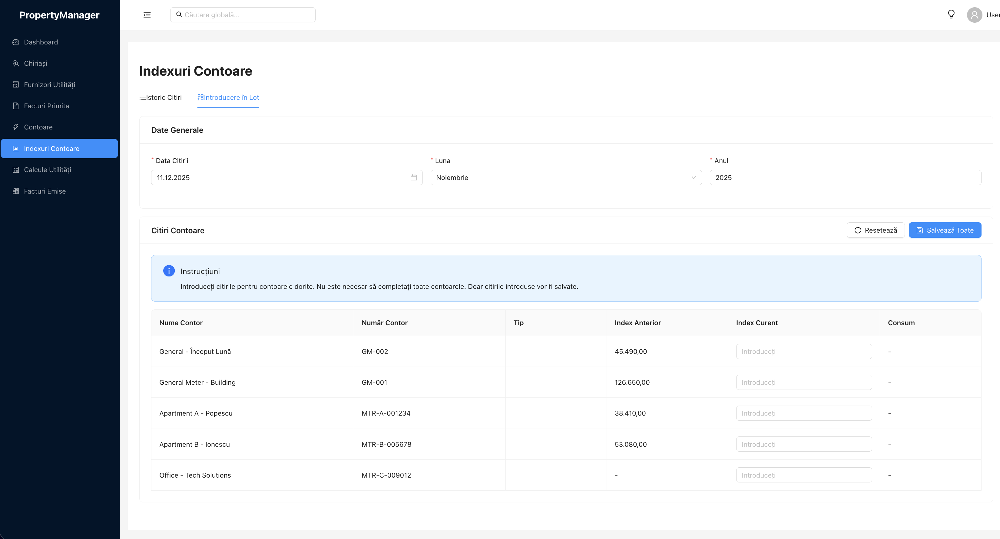
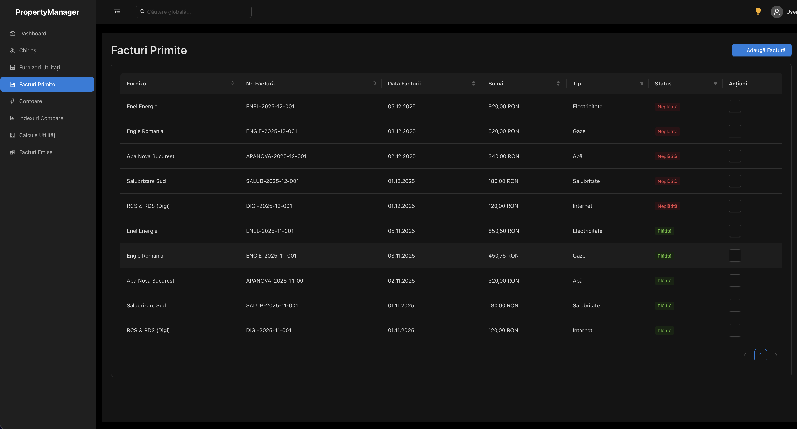
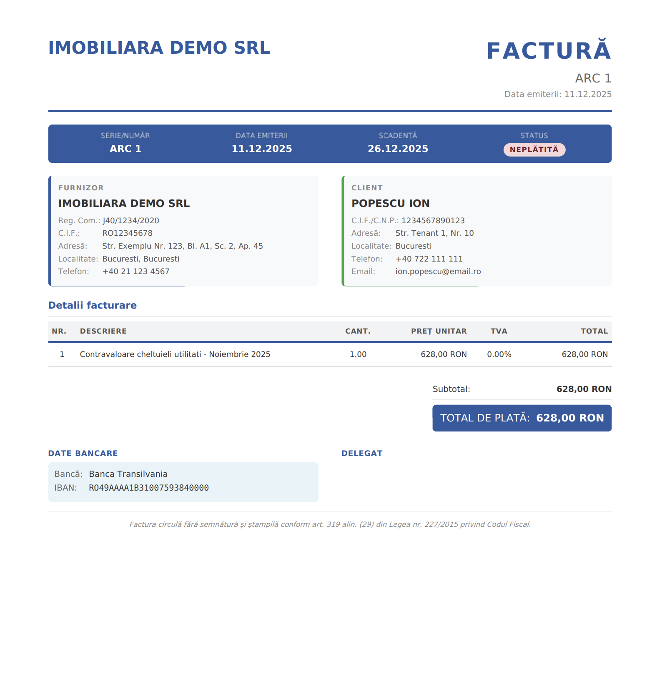

# Property Management & Invoicing System

  

A comprehensive property management application for landlords and property managers. Manage tenants, track utility costs, generate invoices, and monitor cash flow - all in one place.


## Features
  

- ****Tenant Management**** - Track tenant information, contracts, and rental amounts

- ****Utility Cost Tracking**** - Record utility bills and calculate tenant shares based on configurable percentages

- ****Electricity Metering**** - Track meter readings and calculate consumption per tenant

- ****Invoice Generation**** - Generate professional PDF invoices for rent and utilities

- ****BNR Exchange Rates**** - Automatic EUR/RON exchange rate fetching from Romanian National Bank

- ****Dashboard Analytics**** - Visual overview of revenue, expenses, and payment status

- ****Dark Mode**** - Full dark mode support for comfortable viewing

  

## Tech Stack

  

### Backend

- ****Perl 5**** with ****Dancer2**** web framework

- ****DBIx::Class**** ORM

- ****MariaDB/MySQL**** database

- ****JWT**** authentication

- ****wkhtmltopdf**** for PDF generation

  

### Frontend

- ****React 18**** with ****Vite****

- ****Ant Design**** UI components

- ****React Router**** for navigation

- ****Recharts**** for data visualization

- ****Axios**** for API communication

  

### Infrastructure

- ****Docker**** & ****Docker Compose**** for containerization

- ****Nginx**** for frontend serving and API proxy

- ****Starman**** PSGI server for Perl backend

  

## Screenshots


  

### Dashboard



*_Main dashboard showing revenue overview, upcoming payments, and recent activity_*

  

### Tenant Management



*_Tenant list with contract details and utility percentages_*

  

### Invoice Generation



*_Professional invoice with company details and line items_*

  

### Utility Calculations



*_Utility cost breakdown and tenant share calculations_*

  

### Meter Readings



*_Electricity meter tracking with consumption history_*

  

### Dark Mode



*_Full dark mode support across all pages_*

### PDF Invoice Generation

  

## Quick Start

  

### Docker (Recommended)

  

```bash

git clone https://github.com/cristiparaschiv/property-management.git

cd property-management

docker-compose up -d
```

  

Access the application at http://localhost

  

Default credentials: admin / Admin123!

  

### Manual Installation

  

See DEPLOYMENT.txt for complete installation instructions.

  

### Configuration

  

Copy the environment template and configure:

  
```
cp .env.example .env
```
Edit .env with your settings

  

Key environment variables:

- DB_PASSWORD - Database password

- JWT_SECRET - Secret key for JWT tokens

- DB_HOST - Database host (use db for Docker)

  

  

## Author

  

Cristi Paraschiv
